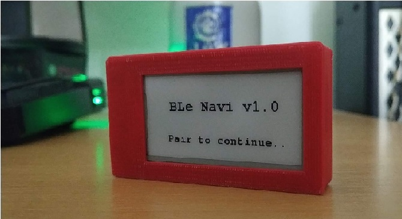

# komoot-eink-navigator
Bluetooth Low Energy companion display for Komoot app

Hardware : Lolin ESP32 eink dev board

How to pair device :

//One time
1.Run the example BLE server program on the board
2.Pair android device using nrfconnect app.
3. Upload the main.ino program

4. Open the komoot app and navigate to profile>settings>Ble connect
5. Reset the board and wait on the screen and the device will automatically pair 
6. Go back and start the navigation under plan and the display will start updating !

